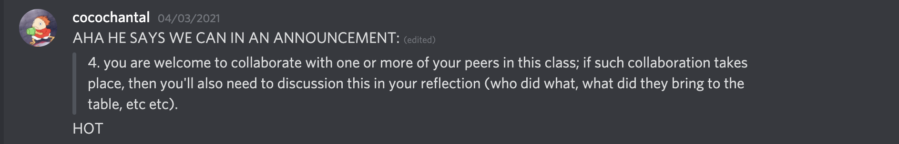

# The Reflection
---
## About the Notebook
- We wanted our notebook to be a random artifact generator of the Ingenium collection.  In doing so, we would allow people to choose their own adventures and make their own stories through the random artifacts they were given.  As Amelia Wong talked about in her article, "Storytelling draws on people’s fluency with other media forms (film, television, poetry, etc.), which may be more inviting to non-traditional audiences. [...] Further, storytelling helps people direct their attention, provoke inquiry, and can motivate deep engagement with content and a desire to 'find out what happens.'" [^1]  We are drawing upon people's fluency with other types of technology as we created this via a notebook and the walkthrough helps explain some of the principles and things to think about as a user interacts with the code and reads the explanations given alongside it.
-   Additionally, we are letting people make their own stories about the artifacts as they can get any order of random artifacts to connect.  While writing a new story is exciting, we still have to think about what our notebook means when these artifacts are taken out of context.  This is good becasue on one hand it allows the user to have a blank slate to work with, but some artifacts may need context in order to be seen and understood.  Nathan Sentance's blog post "Why do we collect," talked about how "collecting for everyone" can be harmful as this could mean that everyone has Eurocentric values and access conditions.[^2]  In showing a single artifact, we could be taking it out of context and not displaying it as the groups it belongs to wanted it to be displayed.  We are displaying it how the museum has it displayed and showcased, which is looking at it through a Western lens and spreading this.  We are taking a Western institution's colelction and displaying it in a different way.  This could lead to artifacts being taken out of context and not understood properly, or it could lead to new artifacts and infomation being discovered.  Our notebook provides new opportunities for users to find somthing new, but also think about why certain artifacts are included and others are not.  This leads us to think about why so much of the collection is not digitized and does not have an image associated with the entry.  When looking at our notebook, the user can see how almost half of the collection cannot be used with our generator, and this can bring up qeustions of what materials are missing and why do they not have photos.  This could be a number of reasons from security issues to the condition of the artifacts, or they do not have the resources/time to photograph them yet.  In terms of the collection itself, Houghton also brought up the point of how long should  artifacts that are deemed worthy of being digitized be stored for? [^3]  We needed to think about this and the implied hierarchy that was given to the artifacts in the collection, and within the groups and categories we further looked at.  Our notebook helps contextalize these questions and gives a concrete way for the user to see and further think about them.  It also lets us take a deeper look at the implied hierarchy in collections at Ingenium, and perhaps in museums as a whole.

- [^1]: Amelia Wong, "The Whole Story, and Then Some: ‘Digital Storytelling’ in Evolving Museum Practice Museums," Museums and the Web,  https://mw2015.museumsandtheweb.com/paper/the-whole-story-and-then-some-digital-storytelling-in-evolving-museum-practice
- [^2]: Nathan Sentance, “Why Do We Collect,” Archival Decolonist blog.  https://archivaldecolonist.com/2018/08/18/why-do-we-collect/
- [^3]: Bernadette Houghton, "Preservation Challenges in the Digital Age," D-Lib Magazine,  http://www.dlib.org/dlib/july16/houghton/07houghton.html

---
## Collaboration
- Our collaboration and organization was done in a way that benefitted both of us and played to our strengths.  Chantal did the programming and technical aspects while Sara learned, took notes, wrote, and, of course, both helped to find the concepts that have been mentioned and thought about in the notebook and within this reflection.  Both of us felt that this was fair as we work well together and are able to recognize our strengths, while still being open to learning and discussing from one anotherr.  We met a number of times on Discord over the course of 2 weeks to discuss and work on the project.  We used [github](https://github.com/ChantalMB/HIST4916-GLAM-Notebook/projects) and a [kanban](https://github.com/ChantalMB/HIST4916-GLAM-Notebook/projects/1) board to stay on top of each other's work and made sure we knew where the project was at in the context of collaboration.
- When thinking of our collaboration in terms of what it means for GLAM organizations, we can see that the arts and sciences are able to work together!  Chantal comes from a computer science background, while Sara comes from an arts background and had never seen a computer before she started this course.  When working together, we both were able to bring our unique perspecitves to this project and offer different ways of thinking.  For example, when we were thinking about *why* our notebook mattered, Sara brought up a point regarding how the notebook could benefit the user as a tool of discovery, as they would be able to find new artifacts they would not actively search for and potentially develop new interests. Chantal said she would not have thought of this as she had been focusing more on the historical implications of the notebook, and we discussed how this instance could reflect how more "academic" digital pursuits might benefit from intergrating the knowledge of museum professionals in a broader context.  In addition, we were both able to start to understand how museums can interact with the digital world and how it can be informative for both sides.  We will go more into detail about our specific roles and views in our individual reflections, but Chantal was able to think about this in terms of how she would go into a museum, while Sara thought about how she could bring someone into a museum.
---
## Sara's Thoughts
- Going into this class I was very excited to learn about digital history and look at museums and other public history institutions through this lens.  My career goal is to work in a museum some day, but many of the courses I have taken focus on the more theorietical aspect of museum studies and public history.  My practicum placement was at Ingenium, so I thought it would be fun to use their data and represent!  As expected, I struggled with the technical aspects of this class and had a very hard time understanding how computers do their thing and how technology works.  I reached out to Chantal often and bless her heart she helped me so much.  When I reached out about the project she suggested we could do it together, and I was so excited to be able to work with another person I jumped at the chance (also Chantal is a fantastic human so I was honoured she asked me). When doing my practicum at Ingenium I was working with their collection and a folder of artifact my supervisor made for me.  I was very surprised at how little infomation there was in some entries compared to others, and more often than not I came across entries that did not have images of the artifact I was identifying.  I was still surprised when we were working on our notebook and saw that so many atrifcats in the collection did not have images as well!  This made me consider, how are people supposed to access artifacts that are in storage and learn about them, if they do not have images indicating what they are?  Even when I was semi-familiarized with their organization system, it took me so long to find artifacts in their warehouses, and sometimes my supervisors were not able to find pieces as well!  I thought about this when we were making our notebook and how people outside of Ingenium can have issues with accessing and understanding the artifacts.  While we hope that the user could find something new when using our notebook, we still had to think about all the artifacts that we could not use due to not having some form of visual identification.  Furthermore, this brings up questions of ownership of the artifacts that were acquired without consent either by the museum or the previous owner.  This way of thinking fits into the colonial paradigm that is reflected in many museums and their collection practices, and implies "that once the Museum possesses something, they alone own it, and they hold onto it tightly." [^4]  Even when I refer to "Ingenium's collection," I am buying into this way of thinking and saying that all the artifact in the collection are theirs.  During my placement I had to oportunity to sit in on a meeting about acquiring new artifacts and deaccessions.  I wish I had asked more about deaccessions and if they were doing any work with First Nations groups to get a better understanding of how that could work.  I also think that moving forward I will ask more of these questions that this class has taught me to ask.  In terms of how underrepresented group's voices are heard and represented within the colleciton and the museum itself, as well as how we can ensure they are heard and respected throughout the whole process.  If that means they take back artifacts or they have the final say in how they will be displayed and what will be said about it, I am excited to put much of what I have learned here into action.
- In addition to the points about ownership and accessibility, one of the articles Chantal lead for discussion helped me think about our notebook as well.  "Some problems with GLAM data on GitHub" by Matthew D. Lincoln was very interesting and their last point about accountability and the commit log helped me think about our notebook. [^5]  While I do not fully understand the technical scope here, I think Chantal and William brought up interesting points at the bottom of the article.  I agree that this is a positive development that could hold institutions accountable and make them more transparent.  In terms of our notebook I think this can be seen on our part if we were to continue with this.  I would want to check in and update the data to see if anything has been added or updated to the collection in order to keep the data current.  Of course this would depend on the museum updating their data, but we could at least continue to check and update our users.  Another thing I was thinking of doing would be to analyze who is using our notebook, for how long, and patterns of artifacts that come up and draw the user to click on the actual page to learn more.  We could see which museum has the most popular artifacts, which museum has the most artifacts, and the average time users are spending on the notebook.  This could give us a better understanding of what our audience is looking for, and what we should include more of. If we were to do this with another colelction, we could compare data and see if the categories and groups are named in similar ways and if they are sorted in similar hierarchies.
- I really enjoyed this class and even though I did not grasp all the technical aspects, I learned a lot about new quesitons to ask and what the future of museums could look like.  I really enjoyed thinking more about accessibility and ownership and how collections and museums can improve, as well as how they can improve with digital literacy.  Chantal's opinions and help not only helped me understand the tech, but also understand new ways of thinking and how to continue to learn.

- [^4]:  Joy Bivens, et al., "Collections: How We Hold the Stuff We Hold in Trust," in _MASSAction, Museums As Site for Social Action_, toolkit, 125, https://static1.squarespace.com/static/58fa685dff7c50f78be5f2b2/t/59dcdd27e5dd5b5a1b51d9d8/1507646780650/TOOLKIT_10_2017.pdf
- [^5]: Matthew D. Lincoln, "Some problems with GLAM data on GitHub," _Matthew Lincoln, PhD_ (blog), January 6, 2016. https://matthewlincoln.net/2016/01/06/some-problems-with-glam-data-on-github.html
---
## Chantal's Thoughts
- Upon opening this reflection document for the first time and seeing everything that Sara has written, I can confidently say that not only did she kill it when writing the guidance in our notebook, but also in conveying our thoughts through this reflection as well-- *exactly* as anticipated! For context, ever since our first year at Carleton Sara and I have had courses together, and during discussions we have always been able to riff off one another like nothing else! Had this seminar been done in-person, I have no doubt you would have heard many statements from me beginning with something along the lines of "building off of what Sara just said..." just as all our other professors have. In a rare turn of events, this course was one which Sara ended up seeking help from *me* when it came to learning the new technologies introduced, which I was happy to help with. This ultimately cumulated in Sara discussing the final assignment with me, because although she knew she wanted to work with the Ingenium collection, she felt overwhelmed by the programming element and didn't know where to start. In that moment, I thought to myself, "what if we could work together on this?" and upon discovering that we could after reading over the course announcements, well, this screenshot of that moment expresses my feelings perfectly:

I was thrilled to finally be able to work on a truly collaborative DH project with a partner, and especially so because I was confident that this partner and I could produce something great! So, this screenshot is where our notebook journey began.

- The creation of this notebook consisted of many hours spent in a Discord video call, doing what me and Sara do best together: discussion. I had [made note of 3 notebooks](https://github.com/ChantalMB/HIST4916-Workbook/blob/master/week-10/week-10.md) in previous weeks that I thought may be interesting to base my final project on, so I brought those to the table where, after clicking through all of them, Sara and I settled on Tim Sherratt's ["A random item from Museums Victoria's collections"](https://glam-workbench.github.io/museumsvictoria/#a-random-item-from-museums-victorias-collections) as a foundation because frankly, we found it the most fun! Yet before even beginning to craft a notebook similar to this one, we stopped to take a moment and consider: besides being fun, how else could this notebook be important? I began racking my brain for answers, trying to consider all of the discussions and readings I had done this semester for potential historical meanings that could be found by a random artifact generator. What implication did removing an artifcat from the context of it's collection have? Is this stripping away the value of an artifact or increasing it by positing it as a lone object? Alas, my thoughts of doom and gloom were broken when Sara proposed the idea that then set the tone for the rest of our work: "Well, one reason it's important is because it lets users find new things right? Stuff they wouldn't search, making them consider a broader range of artifacts and the information we have on them." *Genius.* I had been placing too much value in digging deeper, trying to find abstract meaning, when Sara was right! Few users would find a notebook such as this one important because of some philosophical thought, they would find it important because it was a tool of discovery!
- From there, Sara and I continued to bounce ideas back and forth constantly about what we wanted to show users in the notebook and how things could be extended. Even while programming the notebook, looking over and over at the Ingenium collections data, we were still discussing context in a flurry of:
> "Hm we should try looking at this in something other than a bar graph..."

  > "How about a treemap?"

  > "What's a treemap?"

  > "Like this [screensharing activated]-- it's supposed to show hierarchies though, so I'm not sure if it's good for our data..."

  > "But what if there's hierarchies that we just don't know about?"

  > "OH-- IMPLIED HIERARCHIES!"

  > "YES, PERFECT [the sound of Sara rapidly typing up only our best ideas begins once again]"

And the result of this chaos? A notebook that I'm happier with than anything I've ever done on my own. Sara has extensively covered the meaning of our work already, and because our thoughts are shared, I don't feel I have anything more to add in a tradition "academic" sense, but beyond academia, building this notebook has been an excellent learning experience in terms of perspectives. Yes it's important to think deeply about topics surrounding museums and archives and what their digtized collections imply, but it is easy to fall into a trap where in thinking too deeply about a topic, the answer to "what's the point" becomes lost to most of those interacting with your work. Having Sara-- a person who has focused her studies on museums and public history-- working alongside me and being able to come up with user-centred concepts, fundamentally grounded our project and taught me how to produce something that was both informative to the person who may use it, yet not so in-depth that there is no room for expanded thought. DH and CHI are both fields that need this proposition to extend what has already been produced in order to grow even more, so while detail is great, an invitation to discover your own details is even better.

---
## Conclusions
- Our notebook matters because it not only showcases the Ingenium collection in a new way, thus changing the expectations of the museum learning experience. [^6]  Being able to see an artifact out of context allows the user to form new questions not only about the artifact, but also why it was displayed in a certain way in the first place.  This can help GLAM workers revisit their exhibits and revamp them to reflect more of today and the communities they come from.  Our notebook also looks at the implied hierarchies that are seen in collections and can further help GLAM workers and the public see how things are categoriezed and if this needs to be changed at all.  If every Ingenium museum had commemorative as their highest group, we would need to look at what it was commemorating and if all the artifacts really fit this group.  GLAM workers could also use this as a chance to get input from the public on certain artifacts and if they would work on display a different way or if a group had something to say about how it was displayed in the first place.  Our notebook also helps open the door for arts and sciences/technology to work together and listen to eachother.  There are many things that seem overwhelming in the world of tech, so arts workers might not bother learning or trying to improve those aspects.  When looking at our notebook you can see that arts and sciences can work very well together and provide important perspectives to consider.  Our notebook shows that this relationship can be successful and ultimately helps both the arts and science in the long run.

[^6]: Linda Kelly, "The (post) digital visitor: What has (almost) twenty years of museum audience research revealed?", Museums and the Web,  https://mw2016.museumsandtheweb.com/paper/the-post-digital-visitor-what-has-almost-20-years-of-museum-audience-research-revealed/
---

## References
Bivens, Joy, and Ben Garcia, Porchia Moore, nikhil trivedi, Aletheia Wittman. ‘Collections: How We Hold the Stuff We Hold in Trust’ in _MASSAction, Museums As Site for Social Action_, toolkit, 125-139.  https://static1.squarespace.com/static/58fa685dff7c50f78be5f2b2/t/59dcdd27e5dd5b5a1b51d9d8/1507646780650/TOOLKIT_10_2017.pdf

Houghton, Bernadette.  "Preservation Challenges in the Digital Age." _D-Lib Magazine_.  July/August 2016.  http://www.dlib.org/dlib/july16/houghton/07houghton.html

Kelly, Linda.  "The (post) digital visitor: What has (almost) twenty years of museum audience research revealed?" Museums and the Web.  https://mw2016.museumsandtheweb.com/paper/the-post-digital-visitor-what-has-almost-20-years-of-museum-audience-research-revealed/

Lincoln, Matthew D. "Some problems with GLAM data on GitHub" _Matthew Lincoln, PhD_ (blog). https://matthewlincoln.net/2016/01/06/some-problems-with-glam-data-on-github.html

saywhatnathan.  "Why do we collect?" _Archival Decolonist_ (blog). https://archivaldecolonist.com/2018/08/18/why-do-we-collect/

Wong, Amelia.  "The whole story, and then some: ‘digital storytelling’ in evolving museum practice." Museums in the Web. https://mw2015.museumsandtheweb.com/paper/the-whole-story-and-then-some-digital-storytelling-in-evolving-museum-practice/
